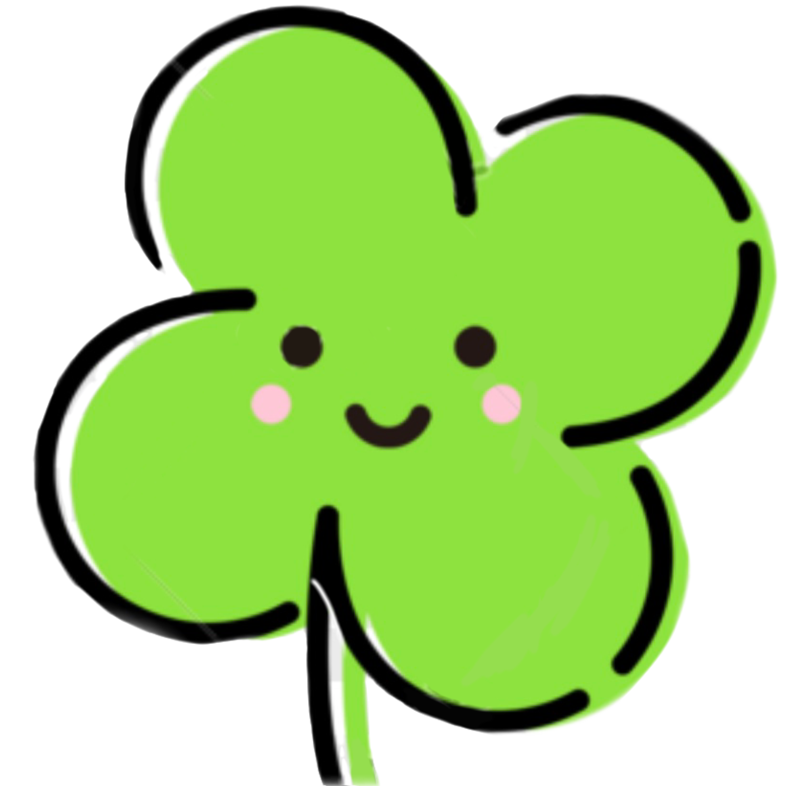

[](https://codebeat.co/projects/github-com-spbu-math-cs-ig-platform-main)
[](https://codecov.io/gh/spbu-math-cs/ig-platform)

# CLVR




Welcome to CLVR, platform for intellectual online-games!

On our platform you can:
* Have one password for all games
* Play tic-tac-toe
* Play !kahoot
* Try out beautiful themes, built for all games
* Create your own templates, as well as try our ones
* Try your own game


## What is included?

This repository provides 4 modules:
* `:platform` -- provides API for creating your own games
* `:server` -- src for our server. Check its easiness and ensure that you can write you own by yourself
* `:tic-tac-toe` -- implementation for tic-tac-toe game
* `:nekahoot` -- implementation for nekahoot game

You can include these modules to your project with [Jitpack](https://jitpack.io/).

## Creating your own game
If you want to build your own game, on backand you just have to implement simple `ActivityInstaller` declared in `:platform`: 
```Kotlin
interface ActivityInstaller<Req: RequestEvent, Resp: ResponseEvent> {
    val activityName: String

    fun decodeJsonToEvent(jsonString: String): Req

    fun install(
        route: Route,
        templateDatabase: TemplateDatabase,
        aufManager: AufManager,
        sessionRegistry: ClvrSessionRegistry<Req, Resp>
    )
}
```

See our implementations of tic-tac-toe and nekahoot as reference examples

## Creating your own server

Creating a server has never been so easy!
After setting up [Ktor](https://ktor.io/), all you have is to setup platform and include all games.
For example, our server with nekahoot and tic-tac-toe is implemented as easy as that:

```Kotlin
private val defaultTicTacToeTemplateFiles = ... // List with json files containing pre-included templates

private val defaultNeKahootTemplateFiles = ... // List with json files containing pre-included templates

private val activityInstallers: List<ActivityInstaller<*, *>> = listOf(
    TicTacToeInstaller(defaultTicTacToeTemplateFiles),
    NeKahootInstaller(defaultNeKahootTemplateFiles),
)

fun Application.module() {
    configurePlatform()
    activityInstallers.forEach {
        installActivity(it)
    }
}
```
